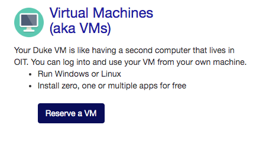
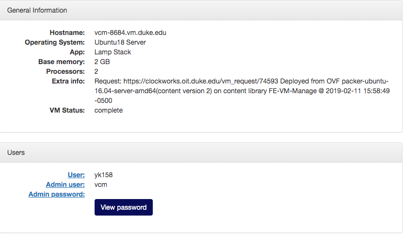
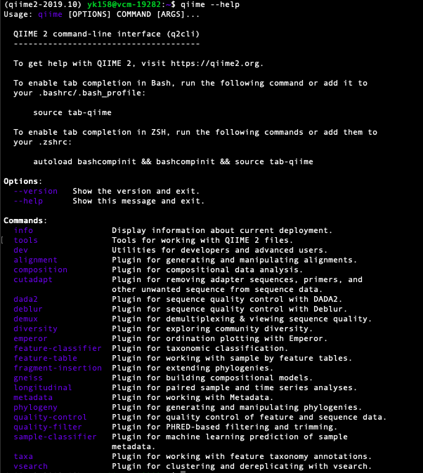

## Get your own Linux
1. Go to [https://vcm.duke.edu/](https://vcm.duke.edu/) and click reserve a VM.  

1. Choose Ubuntu 18.XX.
1. Click your VM and check Host address.

\
\ 

1. Log in in through Terminal (MacOS) or PowerShell (Win)
    ```{bash, eval=FALSE}
    ssh NETID@HOSTNAME
    #example: ssh yk158@vcm-8684.vm.duke.edu
    ```
\ 
1. Enter password of your NetID (not Admin password)
\
\ 

## Install Miniconda

```{bash, eval=FALSE}
#go back to home directory
cd
    
#download the installation script 
wget https://repo.anaconda.com/miniconda/Miniconda3-latest-Linux-x86_64.sh
    
#if `wget` is not available in your OS
#curl -o Miniconda3-latest-Linux-x86_64.sh https://repo.anaconda.com/miniconda/Miniconda3-latest-Linux-x86_64.sh
    
#give permisson to run the installation script
chmod u+x Miniconda3-latest-Linux-x86_64.sh
    
#run installation script
./Miniconda3-latest-Linux-x86_64.sh
    
#enter, yes, enter, yes
    
#load you user profile again so the changes can be applied
source .bashrc
```
\ 

## Install qiime2
```{bash, eval=FALSE}
#download the installation script
wget https://data.qiime2.org/distro/core/qiime2-2019.10-py36-linux-conda.yml

#install qiime2 in conda environment
conda env create -n qiime2-2019.10 --file qiime2-2019.10-py36-linux-conda.yml #take ~5 minutes

#running qiime2 environment
conda activate qiime2-2019.10

#check qiime2 is available
qiime --help
```


\ 

## Every time log in
```{bash, eval=FALSE}
conda activate qiime2-2019.10
```