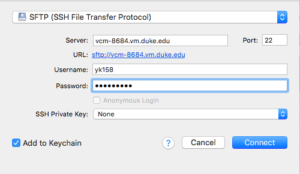
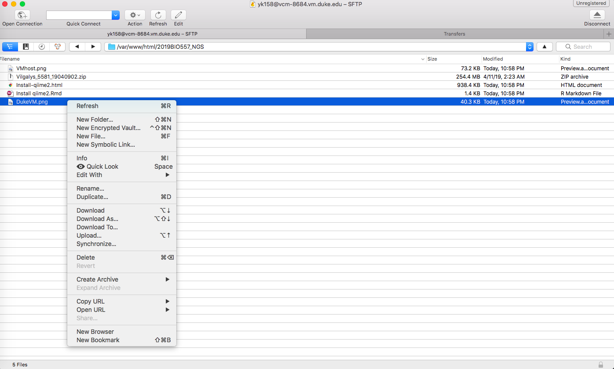

### bash
`bash` is the most common shell in Linux and MacOS. It is the default shell when you open terminal in MacOS or Ubuntu. Here are some frequenctly used commands for file management.
\
\

`pwd` will give you your current working direcotry (folder). Many times the default input and output are set to your working directory. It also shows bwteen : and $ in the begining of each line of terminal.

```{bash}
pwd
```

Notice the path to files is a sequencial slash-seperated string (and case-sensitive).
\
\
`echo` allows you to print words to standard output in terminal.

```{bash}
echo 'Hellow World!'
```
\
`>` allows you to save standart output to a file.

```{bash}
echo 'Hellow World!' > test.txt
```
\
`ls` will list the files and directories under your working directory. 

```{bash}
ls
```
\
`head` and `cat` allows you to print contents of a file to standard output. `head` will only print the first few lines of files. It is handy when the file is large. Notice you only need the file name if the file is under your working dicrtory.

```{bash}
cat test.txt
```
\
`less` open a text browser that you can page up and down. It is usefull when you want to read through a large file.

```{bash}
less test.txt #type `q` to quit
```
\
You can create folder by `mkdir` (make directory) command.

```{bash, eval=FALSE}
mkdir NewFolder
```
\
`mv` and `cp` are cut and copy in `bash`. They are used as 'mv [FileToBeMoved] [destination]'. Now we can move test.txt to NewFolder.

```{bash, eval=FALSE}
cp test.txt NewFolder
```

\
`cd` allows you to change the working dierectory to another directory. We can then enter the folder we just created. 

```{bash, eval=FALSE}
cd NewFolder
pwd
```

```
## /home/yk158/NewFolder
```

\
You may `ls` again to make sure test.txt is in.
\

`rm` removes (delete) files.
```{bash, eval=FALSE}
rm test.txt
```
\

Clean the folder
```{bash, eval=FALSE}
cd ../ # ../ means upper level (enclosing folder)
rm -f -r NewFolder #remove forcibly and recursively
```
\ 

### Download file from remote machine

#### scp
`scp` (secure copy) is the native way to transfer files between machines. It is a combination of `ssh` and `cp`. The path `scp` takes is a combinition of host address and file name, using `:` as seperater.

```{bash, eval=FALSE}
#execute from local machine
scp yk158@vcm-13303.vm.duke.edu:~/test.txt ~/Downloads #it will ask your password
```
\ 


#### Cyberduck
**Cyberduck** is a popular software to transfer file among remote connections. It provides graphic user interface for casual file tranfering.

- Windows: [https://update.cyberduck.io/windows/Cyberduck-Installer-7.2.5.32097.exe](https://update.cyberduck.io/windows/Cyberduck-Installer-7.2.5.32097.exe)

- Mac: [https://update.cyberduck.io/Cyberduck-7.2.5.32097.zip](https://update.cyberduck.io/Cyberduck-7.2.5.32097.zip)

1. "File" > "Open Connection..."
1. Choose "SFTP (SSH File Transfer protocol)"; enter the address, user id, password. 

\
\
1. Then you can download and upload files simply by dragging them.

