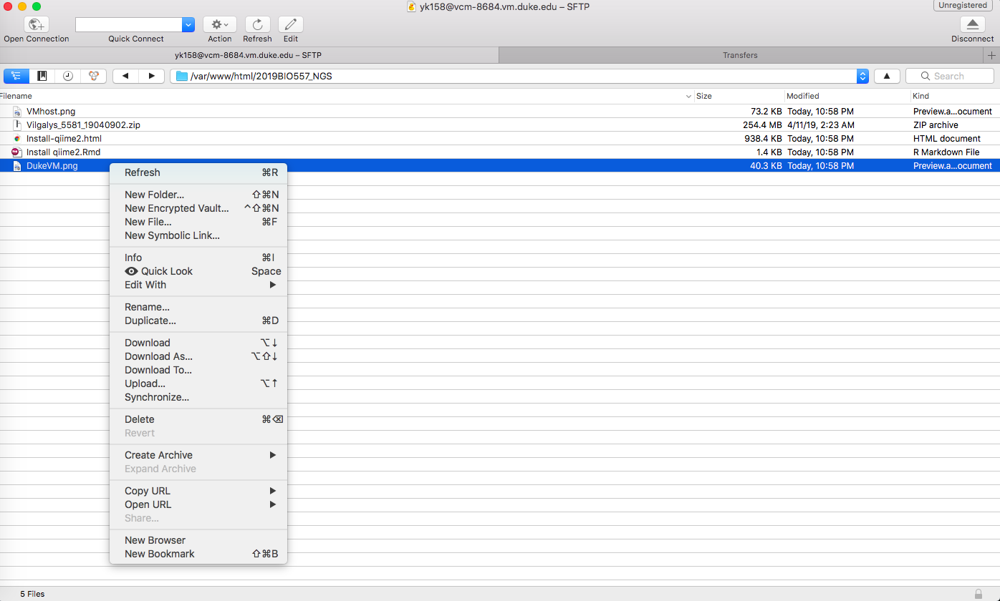

### bash

`bash` is the most common shell in Linux and MacOS. It is the default
shell when you open terminal in MacOS or Ubuntu. Here are some
frequenctly used commands for file management.  
  

`pwd` will give you your current working direcotry (folder). Many times
the default input and output are set to your working directory. It also
shows bwteen : and $ in the begining of each line of terminal.

``` bash
pwd
```

    ## /Users/keyh/2021BIO557_NGS

Notice the path to files is a sequencial slash-seperated string (and
case-sensitive).  
  
`echo` allows you to print words to standard output in terminal.

``` bash
echo 'Hellow World!'
```

    ## Hellow World!

  
`>` allows you to save standart output to a file.

``` bash
echo 'Hellow World!' > test.txt
```

  
`ls` will list the files and directories under your working directory.

``` bash
ls
```

    ## Bac16s
    ## Install-qiime2.Rmd
    ## Install-qiime2.html
    ## Install-qiime2.md
    ## Linux-basics.Rmd
    ## Linux-basics.html
    ## Linux-basics.md
    ## UNITE
    ## qiime-real-data.Rmd
    ## qiime-real-data.html
    ## qiime-real-data_cache
    ## qiime-tutorial.Rmd
    ## qiime-tutorial.html
    ## qiime-tutorial.md
    ## snapshots
    ## test.txt
    ## uniteclasxifier.qza

  
`head` and `cat` allows you to print contents of a file to standard
output. `head` will only print the first few lines of files. It is handy
when the file is large. Notice you only need the file name if the file
is under your working dicrtory.

``` bash
cat test.txt
```

    ## Hellow World!

  
`less` open a text browser that you can page up and down. It is usefull
when you want to read through a large file.

``` bash
less test.txt #type `q` to quit
```

    ## Hellow World!

  
You can create folder by `mkdir` (make directory) command.

``` bash
mkdir NewFolder
```

  
`mv` and `cp` are cut and copy in `bash`. They are used as ‘mv
\[FileToBeMoved\] \[destination\]’. Now we can move test.txt to
NewFolder.

``` bash
cp test.txt NewFolder
```

  
`cd` allows you to change the working dierectory to another directory.
We can then enter the folder we just created.

``` bash
cd NewFolder
pwd
```

    ## /home/yk158/NewFolder

  
You may `ls` again to make sure test.txt is in.  

`rm` removes (delete) files.

``` bash
rm test.txt
```

  

Clean the folder

``` bash
cd ../ # ../ means upper level (enclosing folder)
rm -f -r NewFolder #remove forcibly and recursively
```

 

### Download file from remote machine

#### scp

`scp` (secure copy) is the native way to transfer files between
machines. It is a combination of `ssh` and `cp`. The path `scp` takes is
a combinition of host address and file name, using `:` as seperater.

``` bash
#execute from local machine
scp yk158@vcm-13303.vm.duke.edu:~/test.txt ~/Downloads #it will ask your password
```

 

#### Cyberduck

**Cyberduck** is a popular software to transfer file among remote
connections. It provides graphic user interface for casual file
tranfering.

-   Windows:
    <https://update.cyberduck.io/windows/Cyberduck-Installer-7.2.5.32097.exe>

-   Mac: <https://update.cyberduck.io/Cyberduck-7.2.5.32097.zip>

1.  “File” \> “Open Connection…”
2.  Choose “SFTP (SSH File Transfer protocol)”; enter the address, user
    id, password.   
      
3.  Then you can download and upload files simply by dragging them.
    
