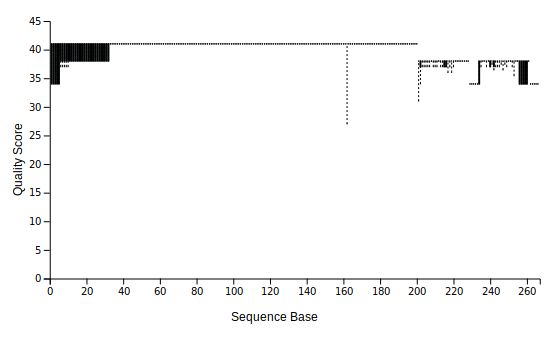
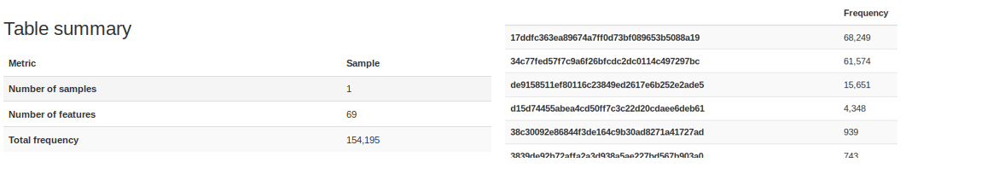

```{r, include=FALSE}
library(knitr)
library(codetools)
opts_chunk$set(echo=TRUE)
opts_chunk$set(cache=TRUE)
opts_chunk$set(eval=FALSE)
```

### Overview
In this tutorial, we move to a more real data that we do not have prepared file format to use in `qiime2`. Fisrt, we download data from [NCBI SRA](https://trace.ncbi.nlm.nih.gov/Traces/sra/) (sequence read archive) with `sra-tools` and import the data to `qiime2`. Then we clean and join the paired-end reads to create a raw feature table and feature sequence. Finally, we cluster the sequence to 97% OTUs and identiy them using bayesian classifier to view the taxonamical component in the sample.

### Data
We use data from a mock community metabarcoding study ([Bakker, 2018](https://doi.org/10.1111/1755-0998.12760)). Nineteen known species were put together in specific abundence and went through the common practive of metabarcoding. We simply take one staggered A treatment as example in this tutorial. You can check the seuqnece project [PRJNA377530](https://www.ncbi.nlm.nih.gov/bioproject/PRJNA377530) and three runs [SRR5314355](https://trace.ncbi.nlm.nih.gov/Traces/sra/?run=SRR5314355), [SRR5314356](https://trace.ncbi.nlm.nih.gov/Traces/sra/?run=SRR5314356), [SRR5314357](https://trace.ncbi.nlm.nih.gov/Traces/sra/?run=SRR5314355)

#### Download data
```{bash, eval=FALSE}
# download sra tools to access data in SRA
cd ~
wget https://ftp-trace.ncbi.nlm.nih.gov/sra/sdk/2.9.4/sratoolkit.2.9.4-ubuntu64.tar.gz
tar -zxvf sratoolkit.2.9.4-ubuntu64.tar.gz
```


```{bash}
#create project directory
mkdir FunITS
cd FunITS
```

```{bash}
#create directory for raw data
mkdir raw
cd raw
```

```{bash}
#download data through fastq-dump
~/sratoolkit.2.9.4-ubuntu64/bin/fastq-dump --split-spot SRR5314355
~/sratoolkit.2.9.4-ubuntu64/bin/fastq-dump --split-spot SRR5314356
~/sratoolkit.2.9.4-ubuntu64/bin/fastq-dump --split-spot SRR5314357
```

```{bash, comment=""}
#check fastq format
head -16 SRR5314355.fastq
```
\ 

#### Prepare and import data
Notice unlike data from sequencing centers, the forward reads and reverse reads in fastq files in many archive (JGI and NCBI) are interleaved, so we need to seperate them in two files again.

```{bash}
#bind multiple fastq files
cat SRR5314355.fastq SRR5314356.fastq SRR5314357.fastq  > stagA.fastq
ls -hl
```

```{bash, comment=""}
#seperate forward and reverse reads
sed -n '1~8{N;N;N;p}' stagA.fastq > stagA_R1.fastq
sed -n '5~8{N;N;N;p}' stagA.fastq > stagA_R2.fastq
head -8 stagA_R1.fastq
head -8 stagA_R2.fastq
cd ../
```

```{r, include=FALSE, cache=FALSE}
knitr::opts_knit$set(root.dir = './FunITS')
```
\ 

Qiime2 requires a control file which lists the paths to all sequence files.

```{bash, comment=""}
# a dirty way to create txt file; use text editor for more complicated data
echo 'sample-id,absolute-filepath,direction' > fileindex.csv
echo 'stagA,$PWD/raw/stagA_R1.fastq,forward'  >> fileindex.csv
echo 'stagA,$PWD/raw/stagA_R2.fastq,reverse'  >> fileindex.csv
cat fileindex.csv
```
\ 

We make a simpliset metadata from our reads since we don't compare treatments in the tutorial.
```{bash, comment=""}
#create metadata
echo -e 'id\ttreatment' > meta.tsv
echo -e 'stagA\tstagA' >> meta.tsv
cat meta.tsv
```

```{bash}
# import data to .qza
qiime tools import \
  --type 'SampleData[PairedEndSequencesWithQuality]' \
  --input-path fileindex.csv \
  --output-path sequence.qza \
  --input-format PairedEndFastqManifestPhred33
```
\ 

#### Join and filter reads from the pairs
```{bash}
#join pair-end reads
qiime vsearch join-pairs \
  --i-demultiplexed-seqs sequence.qza \
  --o-joined-sequences joined_seq.qza

qiime demux summarize \
  --i-data joined_seq.qza \
  --o-visualization joined_seq.qzv
```

```{bash, eval=FALSE}
# view quality score of joined reads
qiime tools view joined_seq.qzv
```

<center>

</center>
\

```{bash}
#discard low quality reads
qiime quality-filter q-score-joined \
  --i-demux joined_seq.qza \
  --o-filtered-sequences joined_seq_filtered.qza \
  --o-filter-stats joined_seq_filter_stats.qza
```

```{bash}
#condense duplicate reads
qiime vsearch dereplicate-sequences \
  --i-sequences joined_seq_filtered.qza \
  --o-dereplicated-table table.qza \
  --o-dereplicated-sequences repseqs.qza
```
\ 

#### *de novo* OTU clustering
```{bash}
#de nove OTU clustering at 97% identity
qiime vsearch cluster-features-de-novo \
  --i-table table.qza \
  --i-sequences repseqs.qza \
  --p-perc-identity 0.97 \
  --o-clustered-table table_97.qza \
  --o-clustered-sequences sequence_97.qza
  
qiime feature-table summarize \
  --i-table table_97.qza \
  --o-visualization table_97.qzv \
  --m-sample-metadata-file meta.tsv
```

```{bash, eval=FALSE}
# view the number of OUTs and their frequency
qiime tools view table_97.qzv
```

<center>
{width=800px}
</center>

#### Bayesian classifier
```{bash, eval=FALSE}
#download reference from UNITE
mkdir UNITE
wget -P ./UNITE/ https://files.plutof.ut.ee/public/orig/51/6F/516F387FC543287E1E2B04BA4654443082FE3D7050E92F5D53BA0702E4E77CD4.zip 
unzip -d ref ./UNITE/516F387FC543287E1E2B04BA4654443082FE3D7050E92F5D53BA0702E4E77CD4.zip
```

```{bash}
#import sequences to .qza
qiime tools import \
 --type 'FeatureData[Sequence]' \
 --input-path ./UNITE/sh_refs_qiime_ver8_97_02.02.2019.fasta \
 --output-path unite_97_seq.qza

qiime tools import \
 --type 'FeatureData[Taxonomy]' \
 --input-format HeaderlessTSVTaxonomyFormat  \
 --input-path ./UNITE/sh_taxonomy_qiime_ver8_97_02.02.2019.txt  \
 --output-path unite_97_tax.qza
```
\ 

The next step takes ~30 mins on my MacBook Air. It is easier to copy *uniteclasxifier.qza* from class material to your FunITS folder.
```{bash, eval=FALSE}
#train bayseian classifier from reference data
qiime feature-classifier fit-classifier-naive-bayes \
  --i-reference-reads unite_97_seq.qza \
  --i-reference-taxonomy unite_97_tax.qza \
  --p-classify--chunk-size 5000 \
  --o-classifier uniteclasxifier.qza
  
#or download pre-trained file
wget http://kefungi.com/2019BIO557_NGS_data/uniteclasxifier.qza
```


```{bash}
#classify sample sequences
qiime feature-classifier classify-sklearn \
  --i-classifier uniteclasxifier.qza \
  --i-reads sequence_97.qza \
  --o-classification taxonomy.qza
```

```{bash}
#view taxa assignment
qiime metadata tabulate \
  --m-input-file taxonomy.qza \
  --o-visualization taxonomy.qzv
```

```{bash}
#taxa summary
qiime taxa barplot \
--i-table table_97.qza \
--i-taxonomy taxonomy.qza \
--m-metadata-file meta.tsv \
--o-visualization barplot.qzv
```


## Appendix: Frequency in Mock Community
Adapted from Bakker, M. G. (2018). A fungal mock community control for amplicon sequencing experiments. Molecular ecology resources, 18(3), 541-556.


### Taxa included

```{r, include=FALSE}
library(tidyverse)
library(magrittr)
library(scales)
data <- read_csv("../Bakker_mock.csv")
```

```{r, echo=FALSE}
kable(data[,1:7])
```

### Phylum Frequency

```{r, echo=FALSE}
kable(data %>% 
  group_by(Division) %>%
  summarise_at(.funs = sum, .vars = c('Even','Staggered A','Staggered B')) %>%
  mutate_at(.vars = c('Even','Staggered A','Staggered B'), .funs = function(x){percent(x/sum(x))})
)
```

### Class Frequency

```{r, echo=FALSE}
kable(data %>% 
  group_by(Class) %>%
  summarise_at(.funs = sum, .vars = c('Even','Staggered A','Staggered B')) %>%
  mutate_at(.vars = c('Even','Staggered A','Staggered B'), .funs = function(x){percent(x/sum(x))})
)
```

### Order Frequency

```{r, echo=FALSE}
kable(data %>% 
  group_by(Order) %>%
  summarise_at(.funs = sum, .vars = c('Even','Staggered A','Staggered B')) %>%
  mutate_at(.vars = c('Even','Staggered A','Staggered B'), .funs = function(x){percent(x/sum(x))})
)
```

### Family Frequency

```{r, echo=FALSE}
kable(data %>% 
  group_by(Family) %>%
  summarise_at(.funs = sum, .vars = c('Even','Staggered A','Staggered B')) %>%
  mutate_at(.vars = c('Even','Staggered A','Staggered B'), .funs = function(x){percent(x/sum(x))})
)
```

### Genus Frequency

```{r, echo=FALSE}
kable(data %>% 
  group_by(Genus) %>%
  summarise_at(.funs = sum, .vars = c('Even','Staggered A','Staggered B')) %>%
  mutate_at(.vars = c('Even','Staggered A','Staggered B'), .funs = function(x){percent(x/sum(x))})
)
```

### Species Frequency

```{r, echo=FALSE}
kable(data %>% 
  group_by(Species) %>%
  summarise_at(.funs = sum, .vars = c('Even','Staggered A','Staggered B')) %>%
  mutate_at(.vars = c('Even','Staggered A','Staggered B'), .funs = function(x){percent(x/sum(x))})
)
```