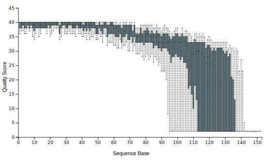
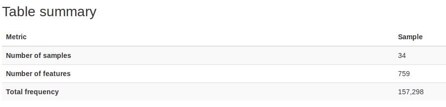
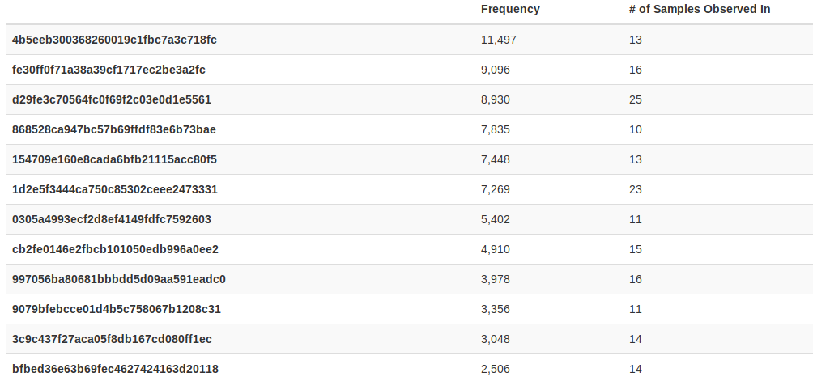
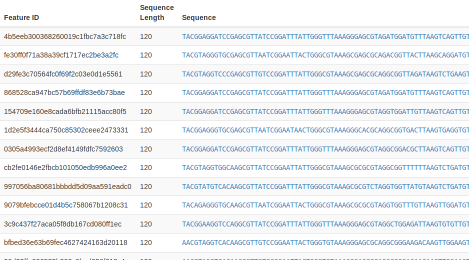
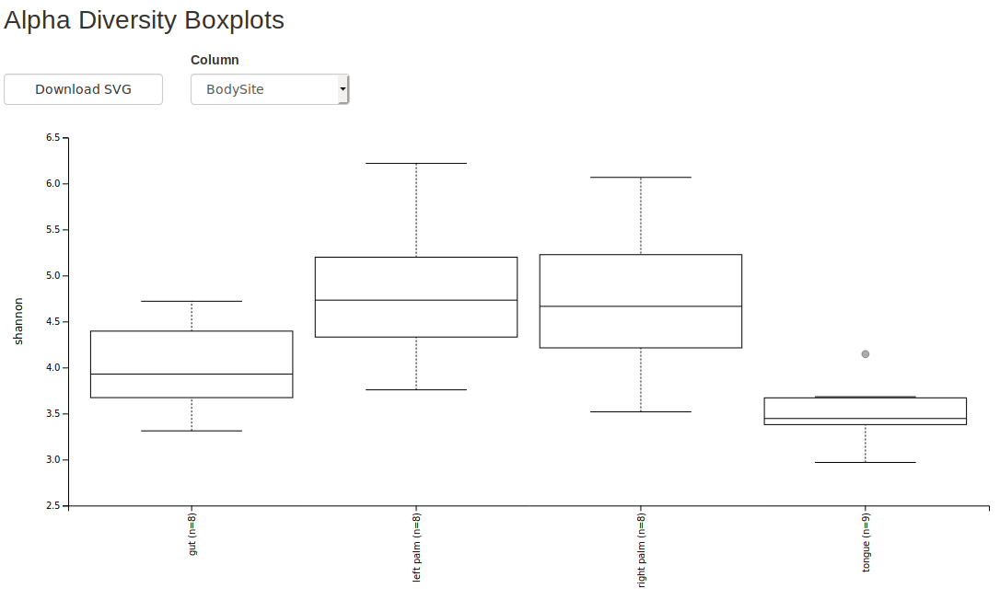
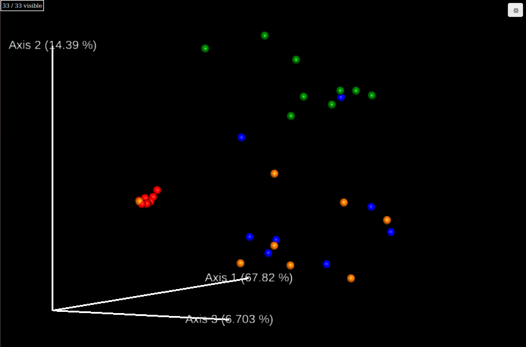
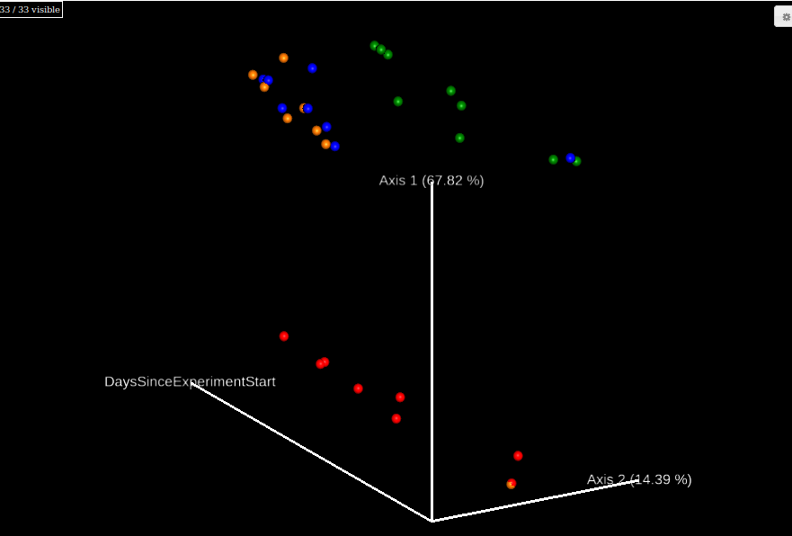
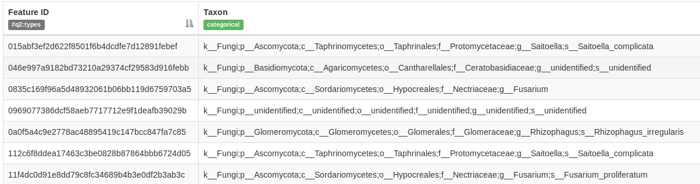

```{r setup, include=FALSE}
library(knitr)
opts_chunk$set(echo=TRUE)
opts_chunk$set(cache=FALSE)
#opts_chunk$set(eval=FALSE)
```

```{bash, include=FALSE}
rm -r -f Bac16s
```

### Overview
This is a tutorial based on [Moving Pictures](https://docs.qiime2.org/2019.1/tutorials/moving-pictures/). The data used in this tutorial is microbiome samples from human body. The tutorial includes demultiplexing sequence, read denoising, infering phylogeneic tree, and diversity anaylysis.
\
\ 
\

When qiime2 is successfully installed and in your path, you can call qiime2 as qiime in your terminal.

```{bash}
#see version of qiime2 and its dependent packages
qiime info
```
\

The basis usage of qiime2 is 

```
qiime [Function] [Subfunction] [--ArgumentName1 argument1] [--ArgumentName2 argument2]...
```
\

Normally arguments start with *--i-* are input file path, *--o-* are output file path, *--m-* are metadata. You can always call built-in documents with *--help* to get a list of function and more information about how to run the command.

```{bash, eval=FALSE}
# try this
qiime dada2 --help
qiime dada2 denoise-single --help
```
\ 

### Download data  
```{bash}
#make new folder/directory for this project
mkdir Bac16s
```

```{bash, eval=FALSE}
#change directory to this project
cd Bac16s
```

```{r, include=FALSE}
opts_knit$set(root.dir = './Bac16s') 
```

```{bash}
#download data "Moving Picture turorial"
wget -nv https://data.qiime2.org/2019.1/tutorials/moving-pictures/emp-single-end-sequences/sequences.fastq.gz
wget -nv https://data.qiime2.org/2019.1/tutorials/moving-pictures/emp-single-end-sequences/barcodes.fastq.gz
wget -nv https://data.qiime2.org/2019.1/tutorials/moving-pictures/sample_metadata.tsv
```

```{bash, comment=""}
#check how .fastq files look like
gzip -c -d sequences.fastq.gz | head -12
```

```{bash, comment=""}
#check how metadata look like
head sample_metadata.tsv
```
\ 

### Import data
```{bash}
#change fastq to qiime format (.qza)
mkdir raw #put raw reads to a seperate folder
mv sequences.fastq.gz raw
mv barcodes.fastq.gz raw

qiime tools import --type EMPSingleEndSequences --input-path ./raw --output-path sequences.qza
```
\ 

### Demultiplex (assign sequences to samples)
All samples (different treatments) are sequenced together, so we need to assign the reads to thier origins by their barcodes.
```{bash}
#Demultiplexing sequences
qiime demux emp-single --i-seqs sequences.qza --m-barcodes-file sample_metadata.tsv --m-barcodes-column BarcodeSequence --o-per-sample-sequences demux.qza --o-error-correction-details demux_stat.qza #sorting by "BarcodeSeqence" column in sample_metadata.tsv

#summarize stats
qiime demux summarize --i-data demux.qza --o-visualization demux.qzv
```
\
You can download `.qzv` file and upload it to https://view.qiime2.org/ to view the visuals. In this case the file is *demux.qzv*.
\
If your system have a web browser, `qiime tools view demux.qzv` will open it in your browser. Type `q` to quit the process. 
\
\
<center>
{width=800px}
{width=600px}
{width=600px}
</center>
\ 

### Filter and clean sequencing error
`dada2` applies statistical model to infer the origin amplicons by finding the "centers" where sequences reads difused from. It is a one line command in `qiime2`.

```{bash}
#clean sequencing error and find unique sequence (OTU)
qiime dada2 denoise-single --i-demultiplexed-seqs demux.qza --p-trim-left 0 --p-trunc-len 120 --o-representative-sequences rep-seqs.qza --o-table table.qza --o-denoising-stats stats-dada2.qza
```
\

Conceptually, there are only two pieces of information you need for downstream analysis: 1) The frequency of OTUs in each sample (feature table) and 2) The DNA sequences of OTUs (representitive sequences). `table.qza` and `rep-seqs.qza` contain the two pieces repectively.

```{bash}
#summerise OTU data in qiime
qiime feature-table summarize --i-table table.qza --o-visualization table.qzv --m-sample-metadata-file sample_metadata.tsv
qiime feature-table tabulate-seqs --i-data rep-seqs.qza --o-visualization rep-seqs.qzv
```

<center>
{width=600px}
{width=600px}
</center>

```{bash, eval=FALSE}
qiime tools view rep-seqs.qzv
```

<center>
{width=600px}
</center>
\
\
The way qiime visuals them is not great. If you want to do customized analysis, it would be helpful just to get the data in common formats. The feature table is written in `biom` format and compressed to `.qza`, so we need some extra packages to deciper it.

```{bash}
pip install biom-format > /dev/null 2>&1 /dev/null

#convert feature table to tsv (tab seperate value) format
qiime tools export --input-path table.qza --output-path ./
biom convert --to-tsv -i feature-table.biom -o feature-table.tsv

#convert representitive sequences to fasta format
qiime tools export --input-path rep-seqs.qza --output-path ./ #sequences in fasta
```

```{bash, comment=""}
head feature-table.tsv
```

```{bash, comment=""}
head dna-sequences.fasta

```
\ 

### Infer phylogenetic tree
To calculate the phylogeny-weighted diversity, we need to infer a phylogenetic tree to obtain phylogenetic distance among the sequences.

```{bash}
##align sequences
qiime alignment mafft --i-sequences rep-seqs.qza --o-alignment aligned-rep-seqs.qza

##infer phylogenetic tree
qiime phylogeny fasttree --i-alignment aligned-rep-seqs.qza --o-tree unroot_tree.qza

##root tree
qiime phylogeny midpoint-root --i-tree unroot_tree.qza  --o-rooted-tree tree.qza
```

```{bash, eval=FALSE}
##Optional: export tree for viewing
qiime tools export --input-path tree.qza --output-path ./
java -jar FigTree\ v1.4.4/lib/figtree.jar #if you have FigTree installed.
```

<center>
{width=600px}
</center>
\ 

### Run diveristy analysis
```{bash}
#conduct all bult-in analysis
qiime diversity core-metrics-phylogenetic --i-phylogeny tree.qza --i-table table.qza --p-sampling-depth 1000 --m-metadata-file sample_metadata.tsv --output-dir diversity-results
```

```{bash}
#alpha diversity by treatments of interest
qiime diversity alpha-group-significance --i-alpha-diversity ./diversity-results/shannon_vector.qza --m-metadata-file sample_metadata.tsv --o-visualization ./diversity-results/shannon-significance.qzv
```

```{bash, eval=FALSE}
qiime tools view ./diversity-results/shannon-significance.qzv
```

<center>
{width=800px}
</center>


```{bash, eval=FALSE}
#view beta diversity by treatments
qiime tools view ./diversity-results/weighted_unifrac_emperor.qzv
```

<center>
{width=600px}
</center>

\ 

```{bash}
#view beta diversity with coutinuous variable
qiime emperor plot --i-pcoa ./diversity-results/weighted_unifrac_pcoa_results.qza --m-metadata-file sample_metadata.tsv --p-custom-axes DaysSinceExperimentStart --o-visualization ./diversity-results/weighted_unifrac-DaysSinceExperimentStart.qzv
```

```{bash, eval=FALSE}
qiime tools view ./diversity-results/weighted_unifrac-DaysSinceExperimentStart.qzv
```
\ 

<center>
{width=600px}
</center>
\ 

### Rarefaction
Rarefaction is base on a pseudo-resampling process from your sequence data. Assuming the distribution of your sample is very close to the population, sampling from you data is the analog of sampling from the population. This is a useful way to infer the distribution of summary statistics you are interested in. (Generally this method only applies to well-sampled data. Metabarcoding experiments usually meet the criterion)

```{bash}
qiime diversity alpha-rarefaction --i-table table.qza --i-phylogeny tree.qza --p-max-depth 4000 --m-metadata-file sample_metadata.tsv --o-visualization alpha-rarefaction.qzv
```

```{bash, eval=FALSE}
qiime tools view alpha-rarefaction.qzv
```


### Taxonomic assignment
```{bash}
# get a pre-trained Bayesian classifier. Check https://docs.qiime2.org/2019.10/tutorials/feature-classifier/ to see how to make your own
wget -q https://data.qiime2.org/2019.10/common/gg-13-8-99-515-806-nb-classifier.qza

# use the trained identifier to identify the representitive sequences
qiime feature-classifier classify-sklearn \
  --i-classifier gg-13-8-99-515-806-nb-classifier.qza \
  --i-reads rep-seqs.qza \
  --o-classification taxonomy.qza

qiime metadata tabulate \
  --m-input-file taxonomy.qza \
  --o-visualization taxonomy.qzv
```
\
\ 


```{bash}
#combine the taxa and their frequency
qiime taxa barplot \
  --i-table table.qza \
  --i-taxonomy taxonomy.qza \
  --m-metadata-file sample_metadata.tsv \
  --o-visualization taxa-bar-plots.qzv
```
\ 


\
\ 

#### Check [ANCOM](https://docs.qiime2.org/2019.10/tutorials/moving-pictures/#differential-abundance-testing-with-ancom) section from qiime website if you still have time.
\
\
\
