### Overview

This is a tutorial based on [Moving
Pictures](https://docs.qiime2.org/2019.1/tutorials/moving-pictures/).
The data used in this tutorial is microbiome samples from human body.
The tutorial includes demultiplexing sequence, read denoising, infering
phylogeneic tree, and diversity anaylysis.  
   

When qiime2 is successfully installed and in your path, you can call
qiime2 as qiime in your terminal.

``` bash
#see version of qiime2 and its dependent packages
qiime info
```

    ## System versions
    ## Python version: 3.6.7
    ## QIIME 2 release: 2019.10
    ## QIIME 2 version: 2019.10.0
    ## q2cli version: 2019.10.0
    ## 
    ## Installed plugins
    ## alignment: 2019.10.0
    ## composition: 2019.10.0
    ## cutadapt: 2019.10.0
    ## dada2: 2019.10.0
    ## deblur: 2019.10.0
    ## demux: 2019.10.0
    ## diversity: 2019.10.0
    ## emperor: 2019.10.0
    ## feature-classifier: 2019.10.0
    ## feature-table: 2019.10.0
    ## fragment-insertion: 2019.10.0
    ## gneiss: 2019.10.0
    ## longitudinal: 2019.10.0
    ## metadata: 2019.10.0
    ## phylogeny: 2019.10.0
    ## quality-control: 2019.10.0
    ## quality-filter: 2019.10.0
    ## sample-classifier: 2019.10.0
    ## taxa: 2019.10.0
    ## types: 2019.10.0
    ## vsearch: 2019.10.0
    ## 
    ## Application config directory
    ## /home/yk158/miniconda3/envs/qiime2-2019.10/var/q2cli
    ## 
    ## Getting help
    ## To get help with QIIME 2, visit https://qiime2.org

  

The basis usage of qiime2 is

    qiime [Function] [Subfunction] [--ArgumentName1 argument1] [--ArgumentName2 argument2]...

  

Normally arguments start with *–i-* are input file path, *–o-* are
output file path, *–m-* are metadata. You can always call built-in
documents with *–help* to get a list of function and more information
about how to run the command.

``` bash
# try this
qiime dada2 --help
qiime dada2 denoise-single --help
```

 

### Download data

``` bash
#make new folder/directory for this project
mkdir Bac16s
```

``` bash
#change directory to this project
cd Bac16s
```

``` bash
#download data "Moving Picture turorial"
wget -nv https://data.qiime2.org/2019.1/tutorials/moving-pictures/emp-single-end-sequences/sequences.fastq.gz
wget -nv https://data.qiime2.org/2019.1/tutorials/moving-pictures/emp-single-end-sequences/barcodes.fastq.gz
wget -nv https://data.qiime2.org/2019.1/tutorials/moving-pictures/sample_metadata.tsv
```

    ## 2021-03-15 16:09:04 URL:https://s3-us-west-2.amazonaws.com/qiime2-data/2019.1/tutorials/moving-pictures/emp-single-end-sequences/sequences.fastq.gz [25303756/25303756] -> "sequences.fastq.gz" [1]
    ## 2021-03-15 16:09:05 URL:https://s3-us-west-2.amazonaws.com/qiime2-data/2019.1/tutorials/moving-pictures/emp-single-end-sequences/barcodes.fastq.gz [3783785/3783785] -> "barcodes.fastq.gz" [1]
    ## 2021-03-15 16:09:06 URL:https://doc-0o-6o-sheets.googleusercontent.com/export/l5l039s6ni5uumqbsj9o11lmdc/m6huuikika277gvvq9tj7qulvk/1615838945000/103995680502445084602/*/1yFL_Mwh7b5LE5vW06KooZFB_cjoEJEXGFwhos6X7jns?gid=0&format=tsv [3785] -> "sample_metadata.tsv" [1]

``` bash
#check how .fastq files look like
gzip -c -d sequences.fastq.gz | head -12
```

    @HWI-EAS440_0386:1:23:17547:1423#0/1
    TACGNAGGATCCGAGCGTTATCCGGATTTATTGGGTTTAAAGGGAGCGTAGATGGATGTTTAAGTCAGTTGTGAAAGTTTGCGGCTCAACCGTAAAATTGCAGTTGATACTGGATATCTTGAGTGCAGTTGAGGCAGGGGGGGATTGGTGTG
    +
    IIIE)EEEEEEEEGFIIGIIIHIHHGIIIGIIHHHGIIHGHEGDGIFIGEHGIHHGHHGHHGGHEEGHEGGEHEBBHBBEEDCEDDD>B?BE@@B>@@@@@CB@ABA@@?@@=>?08;3=;==8:5;@6?######################
    @HWI-EAS440_0386:1:23:14818:1533#0/1
    CCCCNCAGCGGCAAAAATTAAAATTTTTACCGCTTCGGCGTTATAGCCTCACACTCAATCTTTTATCACGAAGTCATGATTGAATCGCGAGTGGTCGGCAGATTGCGATAAACGGGCACATTAAATTTAAACTGATGATTCCACTGCAACAA
    +
    64<2$24;1)/:*B<?BBDDBBD<>BDD############################################################################################################################
    @HWI-EAS440_0386:1:23:14401:1629#0/1
    TACGNAGGATCCGAGCGTTATCCGGATTTATTGGGTTTAAAGGGAGCGTAGGCGGACGCTTAAGTCAGTTGTGAAAGTTTGCGGCTCAACCGTAAAATTGCAGTTGATACTGGGTGTCTTGAGTACAGTAGAGGCAGGGGGGGGGTTGGGGG
    +
    GGGC'ACC8;;>;HHHHGHDHHHHHEEHHEHHHHHECHEEEHCHFHHHAGGEHHFBCCBABBBE>>>E=>A>A<>>B8B:B=BBABA@AAAA@?>???>>>9>@AA@@@@AA########################################

``` bash
#check how metadata look like
head sample_metadata.tsv
```

    #SampleID   BarcodeSequence LinkerPrimerSequence    BodySite    Year    Month   Day Subject ReportedAntibioticUsage DaysSinceExperimentStart    Description
    #q2:types   categorical categorical categorical numeric numeric numeric categorical categorical numeric categorical
    L1S8    AGCTGACTAGTC    GTGCCAGCMGCCGCGGTAA gut 2008    10  28  subject-1   Yes 0   subject-1.gut.2008-10-28
    L1S57   ACACACTATGGC    GTGCCAGCMGCCGCGGTAA gut 2009    1   20  subject-1   No  84  subject-1.gut.2009-1-20
    L1S76   ACTACGTGTGGT    GTGCCAGCMGCCGCGGTAA gut 2009    2   17  subject-1   No  112 subject-1.gut.2009-2-17
    L1S105  AGTGCGATGCGT    GTGCCAGCMGCCGCGGTAA gut 2009    3   17  subject-1   No  140 subject-1.gut.2009-3-17
    L2S155  ACGATGCGACCA    GTGCCAGCMGCCGCGGTAA left palm   2009    1   20  subject-1   No  84  subject-1.left-palm.2009-1-20
    L2S175  AGCTATCCACGA    GTGCCAGCMGCCGCGGTAA left palm   2009    2   17  subject-1   No  112 subject-1.left-palm.2009-2-17
    L2S204  ATGCAGCTCAGT    GTGCCAGCMGCCGCGGTAA left palm   2009    3   17  subject-1   No  140 subject-1.left-palm.2009-3-17
    L2S222  CACGTGACATGT    GTGCCAGCMGCCGCGGTAA left palm   2009    4   14  subject-1   No  168 subject-1.left-palm.2009-4-14

 

### Import data

``` bash
#change fastq to qiime format (.qza)
mkdir raw #put raw reads to a seperate folder
mv sequences.fastq.gz raw
mv barcodes.fastq.gz raw

qiime tools import --type EMPSingleEndSequences --input-path ./raw --output-path sequences.qza
```

    ## Imported ./raw as EMPSingleEndDirFmt to sequences.qza

 

### Demultiplex (assign sequences to samples)

All samples (different treatments) are sequenced together, so we need to
assign the reads to thier origins by their barcodes.

``` bash
#Demultiplexing sequences
qiime demux emp-single --i-seqs sequences.qza --m-barcodes-file sample_metadata.tsv --m-barcodes-column BarcodeSequence --o-per-sample-sequences demux.qza --o-error-correction-details demux_stat.qza #sorting by "BarcodeSeqence" column in sample_metadata.tsv

#summarize stats
qiime demux summarize --i-data demux.qza --o-visualization demux.qzv
```

    ## Saved SampleData[SequencesWithQuality] to: demux.qza
    ## Saved ErrorCorrectionDetails to: demux_stat.qza
    ## Saved Visualization to: demux.qzv

  
You can download `.qzv` file and upload it to
<a href="https://view.qiime2.org/" class="uri">https://view.qiime2.org/</a>
to view the visuals. In this case the file is *demux.qzv*.  
If your system have a web browser, `qiime tools view demux.qzv` will
open it in your browser. Type `q` to quit the process.  
  
<center>
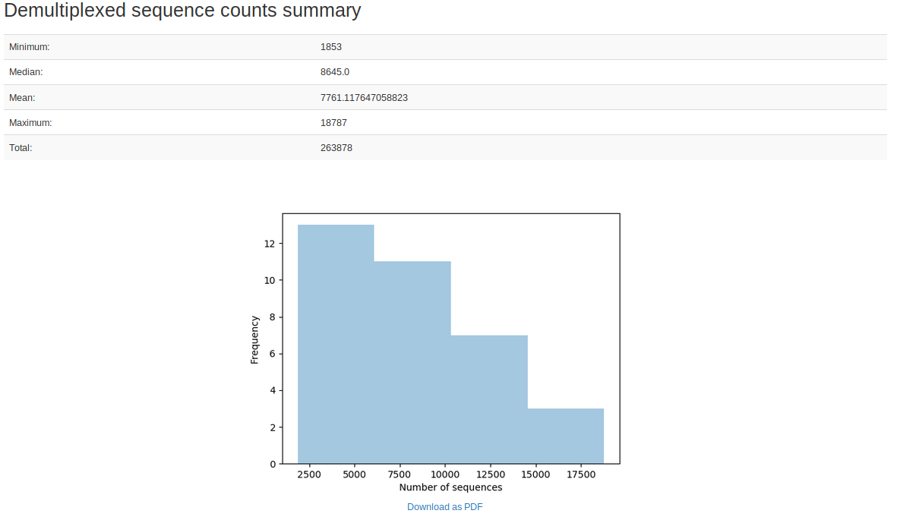
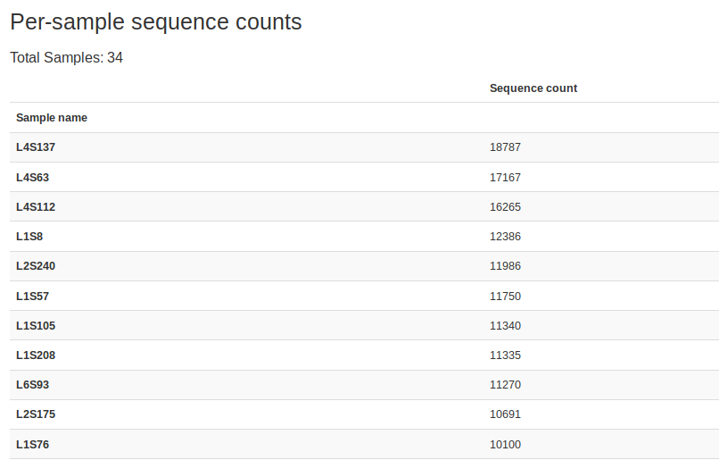
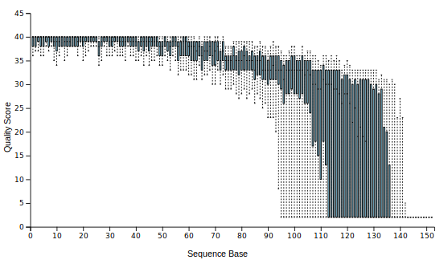
</center>

 

### Filter and clean sequencing error

`dada2` applies statistical model to infer the origin amplicons by
finding the “centers” where sequences reads difused from. It is a one
line command in `qiime2`.

``` bash
#clean sequencing error and find unique sequence (OTU)
qiime dada2 denoise-single --i-demultiplexed-seqs demux.qza --p-trim-left 0 --p-trunc-len 120 --o-representative-sequences rep-seqs.qza --o-table table.qza --o-denoising-stats stats-dada2.qza
```

    ## Saved FeatureTable[Frequency] to: table.qza
    ## Saved FeatureData[Sequence] to: rep-seqs.qza
    ## Saved SampleData[DADA2Stats] to: stats-dada2.qza

  

Conceptually, there are only two pieces of information you need for
downstream analysis: 1) The frequency of OTUs in each sample (feature
table) and 2) The DNA sequences of OTUs (representitive sequences).
`table.qza` and `rep-seqs.qza` contain the two pieces repectively.

``` bash
#summerise OTU data in qiime
qiime feature-table summarize --i-table table.qza --o-visualization table.qzv --m-sample-metadata-file sample_metadata.tsv
qiime feature-table tabulate-seqs --i-data rep-seqs.qza --o-visualization rep-seqs.qzv
```

    ## Saved Visualization to: table.qzv
    ## Saved Visualization to: rep-seqs.qzv

<center>
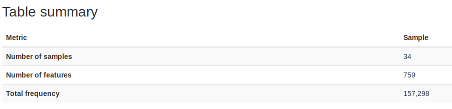
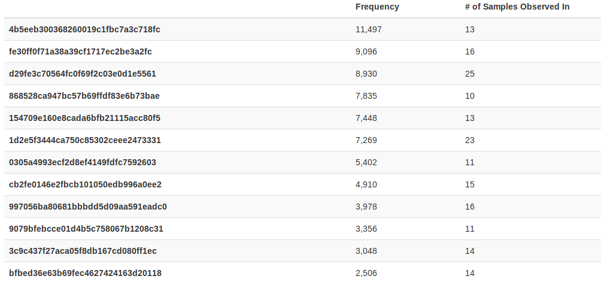
</center>

``` bash
qiime tools view rep-seqs.qzv
```

<center>
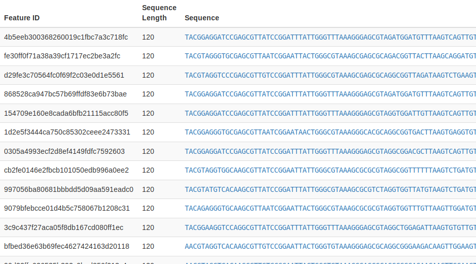
</center>

  
  
The way qiime visuals them is not great. If you want to do customized
analysis, it would be helpful just to get the data in common formats.
The feature table is written in `biom` format and compressed to `.qza`,
so we need some extra packages to deciper it.

``` bash
pip install biom-format > /dev/null 2>&1 /dev/null

#convert feature table to tsv (tab seperate value) format
qiime tools export --input-path table.qza --output-path ./
biom convert --to-tsv -i feature-table.biom -o feature-table.tsv

#convert representitive sequences to fasta format
qiime tools export --input-path rep-seqs.qza --output-path ./ #sequences in fasta
```

    ## Exported table.qza as BIOMV210DirFmt to directory ./
    ## Exported rep-seqs.qza as DNASequencesDirectoryFormat to directory ./

``` bash
head feature-table.tsv
```

    # Constructed from biom file
    #OTU ID L1S105  L1S140  L1S208  L1S257  L1S281  L1S57   L1S76   L1S8    L2S155  L2S175  L2S204  L2S222  L2S240  L2S309  L2S357  L2S382  L3S242  L3S294  L3S313  L3S341  L3S360  L3S378  L4S112  L4S137  L4S63   L5S104  L5S155  L5S174  L5S203  L5S222  L5S240  L6S20   L6S68   L6S93
    4b5eeb300368260019c1fbc7a3c718fc    2183.0  0.0 0.0 0.0 0.0 2820.0  3313.0  2599.0  10.0    10.0    23.0    0.0 0.0 0.0 14.0    0.0 350.0   0.0 6.0 11.0    0.0 0.0 55.0    0.0 0.0 10.0    0.0 0.0 0.0 0.0 0.0 0.0 0.0 0.0
    fe30ff0f71a38a39cf1717ec2be3a2fc    5.0 0.0 0.0 0.0 0.0 0.0 0.0 0.0 0.0 0.0 24.0    32.0    996.0   47.0    121.0   80.0    0.0 0.0 0.0 22.0    16.0    0.0 330.0   335.0   160.0   0.0 0.0 0.0 0.0 0.0 374.0   3325.0  1725.0  1341.0
    d29fe3c70564fc0f69f2c03e0d1e5561    0.0 0.0 0.0 0.0 0.0 0.0 0.0 0.0 353.0   779.0   95.0    104.0   341.0   230.0   407.0   494.0   0.0 46.0    144.0   70.0    35.0    3.0 1269.0  1712.0  417.0   216.0   140.0   107.0   215.0   148.0   117.0   215.0   500.0   465.0
    868528ca947bc57b69ffdf83e6b73bae    0.0 2249.0  2117.0  1191.0  1737.0  0.0 0.0 0.0 0.0 0.0 0.0 0.0 0.0 20.0    0.0 0.0 0.0 0.0 0.0 0.0 13.0    351.0   0.0 0.0 0.0 0.0 0.0 0.0 5.0 0.0 10.0    0.0 0.0 9.0
    154709e160e8cada6bfb21115acc80f5    802.0   1174.0  694.0   406.0   242.0   1081.0  930.0   1623.0  0.0 0.0 0.0 0.0 3.0 12.0    0.0 0.0 234.0   0.0 0.0 0.0 0.0 201.0   0.0 0.0 0.0 0.0 9.0 0.0 0.0 0.0 0.0 0.0 0.0 0.0
    1d2e5f3444ca750c85302ceee2473331    0.0 0.0 5.0 0.0 0.0 0.0 0.0 5.0 27.0    51.0    0.0 0.0 1181.0  25.0    36.0    76.0    5.0 0.0 16.0    15.0    0.0 0.0 124.0   355.0   84.0    529.0   453.0   254.0   342.0   374.0   532.0   940.0   1214.0  541.0
    0305a4993ecf2d8ef4149fdfc7592603    1197.0  647.0   964.0   911.0   531.0   415.0   334.0   243.0   0.0 0.0 0.0 0.0 0.0 0.0 0.0 0.0 28.0    0.0 0.0 0.0 0.0 117.0   0.0 5.0 0.0 0.0 0.0 0.0 0.0 0.0 0.0 0.0 0.0 0.0
    cb2fe0146e2fbcb101050edb996a0ee2    0.0 0.0 6.0 7.0 0.0 0.0 0.0 0.0 82.0    227.0   96.0    49.0    0.0 276.0   318.0   105.0   0.0 75.0    145.0   59.0    24.0    0.0 1392.0  366.0   1427.0  0.0 0.0 0.0 0.0 0.0 0.0 0.0 0.0 0.0

``` bash
head dna-sequences.fasta
```

    >4b5eeb300368260019c1fbc7a3c718fc
    TACGGAGGATCCGAGCGTTATCCGGATTTATTGGGTTTAAAGGGAGCGTAGATGGATGTTTAAGTCAGTTGTGAAAGTTTGCGGCTCAACCGTAAAATTGCAGTTGATACTGGATATCTT
    >fe30ff0f71a38a39cf1717ec2be3a2fc
    TACGTAGGGTGCGAGCGTTAATCGGAATTACTGGGCGTAAAGCGAGCGCAGACGGTTACTTAAGCAGGATGTGAAATCCCCGGGCTCAACCTGGGAACTGCGTTCTGAACTGGGTGACTA
    >d29fe3c70564fc0f69f2c03e0d1e5561
    TACGTAGGTCCCGAGCGTTGTCCGGATTTATTGGGCGTAAAGCGAGCGCAGGCGGTTAGATAAGTCTGAAGTTAAAGGCTGTGGCTTAACCATAGTACGCTTTGGAAACTGTTTAACTTG
    >868528ca947bc57b69ffdf83e6b73bae
    TACGGAGGATCCGAGCGTTATCCGGATTTATTGGGTTTAAAGGGAGCGTAGATGGATGTTTAAGTCAGTTGTGAAAGTTTGCGGCTCAACCGTAAAATTGCAGTTGATACTGGATGTCTT
    >154709e160e8cada6bfb21115acc80f5
    TACGGAGGATCCGAGCGTTATCCGGATTTATTGGGTTTAAAGGGAGCGTAGGTGGATTGTTAAGTCAGTTGTGAAAGTTTGCGGCTCAACCGTAAAATTGCAGTTGAAACTGGCAGTCTT

 

### Infer phylogenetic tree

To calculate the phylogeny-weighted diversity, we need to infer a
phylogenetic tree to obtain phylogenetic distance among the sequences.

``` bash
##align sequences
qiime alignment mafft --i-sequences rep-seqs.qza --o-alignment aligned-rep-seqs.qza

##infer phylogenetic tree
qiime phylogeny fasttree --i-alignment aligned-rep-seqs.qza --o-tree unroot_tree.qza

##root tree
qiime phylogeny midpoint-root --i-tree unroot_tree.qza  --o-rooted-tree tree.qza
```

    ## Saved FeatureData[AlignedSequence] to: aligned-rep-seqs.qza
    ## Saved Phylogeny[Unrooted] to: unroot_tree.qza
    ## Saved Phylogeny[Rooted] to: tree.qza

``` bash
##Optional: export tree for viewing
qiime tools export --input-path tree.qza --output-path ./
java -jar FigTree\ v1.4.4/lib/figtree.jar #if you have FigTree installed.
```

<center>
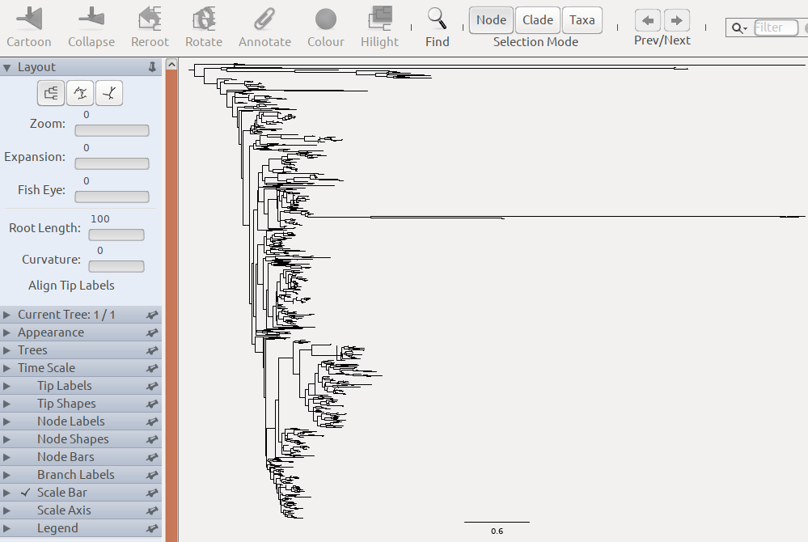
</center>

 

### Run diveristy analysis

``` bash
#conduct all bult-in analysis
qiime diversity core-metrics-phylogenetic --i-phylogeny tree.qza --i-table table.qza --p-sampling-depth 1000 --m-metadata-file sample_metadata.tsv --output-dir diversity-results
```

    ## Saved FeatureTable[Frequency] to: diversity-results/rarefied_table.qza
    ## Saved SampleData[AlphaDiversity] % Properties('phylogenetic') to: diversity-results/faith_pd_vector.qza
    ## Saved SampleData[AlphaDiversity] to: diversity-results/observed_otus_vector.qza
    ## Saved SampleData[AlphaDiversity] to: diversity-results/shannon_vector.qza
    ## Saved SampleData[AlphaDiversity] to: diversity-results/evenness_vector.qza
    ## Saved DistanceMatrix % Properties('phylogenetic') to: diversity-results/unweighted_unifrac_distance_matrix.qza
    ## Saved DistanceMatrix % Properties('phylogenetic') to: diversity-results/weighted_unifrac_distance_matrix.qza
    ## Saved DistanceMatrix to: diversity-results/jaccard_distance_matrix.qza
    ## Saved DistanceMatrix to: diversity-results/bray_curtis_distance_matrix.qza
    ## Saved PCoAResults to: diversity-results/unweighted_unifrac_pcoa_results.qza
    ## Saved PCoAResults to: diversity-results/weighted_unifrac_pcoa_results.qza
    ## Saved PCoAResults to: diversity-results/jaccard_pcoa_results.qza
    ## Saved PCoAResults to: diversity-results/bray_curtis_pcoa_results.qza
    ## Saved Visualization to: diversity-results/unweighted_unifrac_emperor.qzv
    ## Saved Visualization to: diversity-results/weighted_unifrac_emperor.qzv
    ## Saved Visualization to: diversity-results/jaccard_emperor.qzv
    ## Saved Visualization to: diversity-results/bray_curtis_emperor.qzv

``` bash
#alpha diversity by treatments of interest
qiime diversity alpha-group-significance --i-alpha-diversity ./diversity-results/shannon_vector.qza --m-metadata-file sample_metadata.tsv --o-visualization ./diversity-results/shannon-significance.qzv
```

    ## Saved Visualization to: ./diversity-results/shannon-significance.qzv

``` bash
qiime tools view ./diversity-results/shannon-significance.qzv
```

<center>
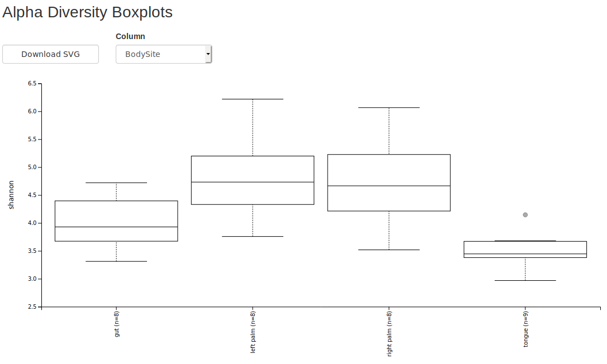
</center>

``` bash
#view beta diversity by treatments
qiime tools view ./diversity-results/weighted_unifrac_emperor.qzv
```

<center>
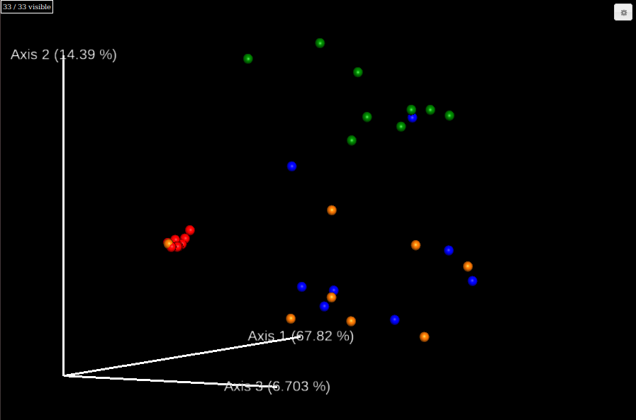
</center>

 

``` bash
#view beta diversity with coutinuous variable
qiime emperor plot --i-pcoa ./diversity-results/weighted_unifrac_pcoa_results.qza --m-metadata-file sample_metadata.tsv --p-custom-axes DaysSinceExperimentStart --o-visualization ./diversity-results/weighted_unifrac-DaysSinceExperimentStart.qzv
```

    ## Saved Visualization to: ./diversity-results/weighted_unifrac-DaysSinceExperimentStart.qzv

``` bash
qiime tools view ./diversity-results/weighted_unifrac-DaysSinceExperimentStart.qzv
```

 

<center>
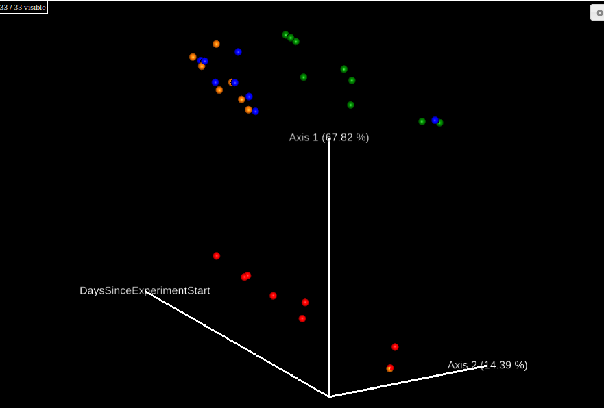
</center>

 

### Rarefaction

Rarefaction is base on a pseudo-resampling process from your sequence
data. Assuming the distribution of your sample is very close to the
population, sampling from you data is the analog of sampling from the
population. This is a useful way to infer the distribution of summary
statistics you are interested in. (Generally this method only applies to
well-sampled data. Metabarcoding experiments usually meet the criterion)

``` bash
qiime diversity alpha-rarefaction --i-table table.qza --i-phylogeny tree.qza --p-max-depth 4000 --m-metadata-file sample_metadata.tsv --o-visualization alpha-rarefaction.qzv
```

    ## Saved Visualization to: alpha-rarefaction.qzv

``` bash
qiime tools view alpha-rarefaction.qzv
```

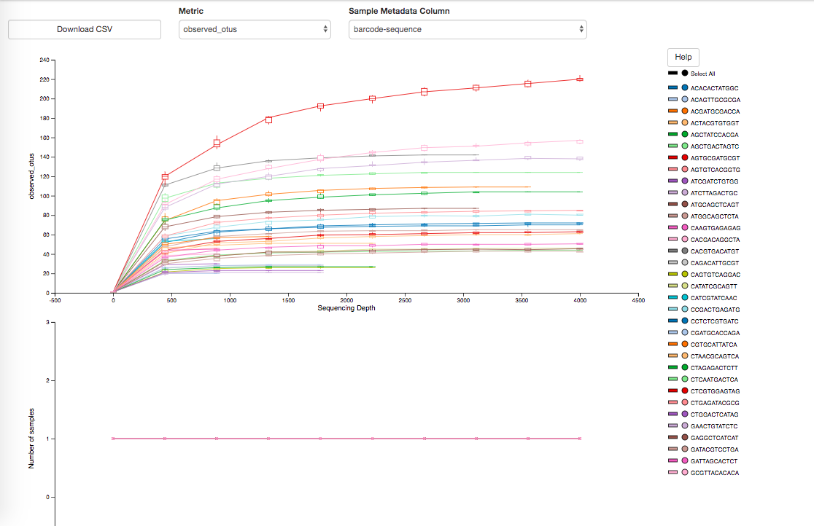

### Taxonomic assignment

``` bash
# get a pre-trained Bayesian classifier. Check https://docs.qiime2.org/2019.10/tutorials/feature-classifier/ to see how to make your own
wget -q https://data.qiime2.org/2019.10/common/gg-13-8-99-515-806-nb-classifier.qza

# use the trained identifier to identify the representitive sequences
qiime feature-classifier classify-sklearn \
  --i-classifier gg-13-8-99-515-806-nb-classifier.qza \
  --i-reads rep-seqs.qza \
  --o-classification taxonomy.qza

qiime metadata tabulate \
  --m-input-file taxonomy.qza \
  --o-visualization taxonomy.qzv
```

    ## Saved FeatureData[Taxonomy] to: taxonomy.qza
    ## Saved Visualization to: taxonomy.qzv

  
  

``` bash
#combine the taxa and their frequency
qiime taxa barplot \
  --i-table table.qza \
  --i-taxonomy taxonomy.qza \
  --m-metadata-file sample_metadata.tsv \
  --o-visualization taxa-bar-plots.qzv
```

    ## Saved Visualization to: taxa-bar-plots.qzv

  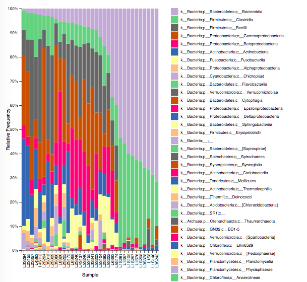

  
 

#### Check [ANCOM](https://docs.qiime2.org/2019.10/tutorials/moving-pictures/#differential-abundance-testing-with-ancom) section from qiime website if you still have time.
